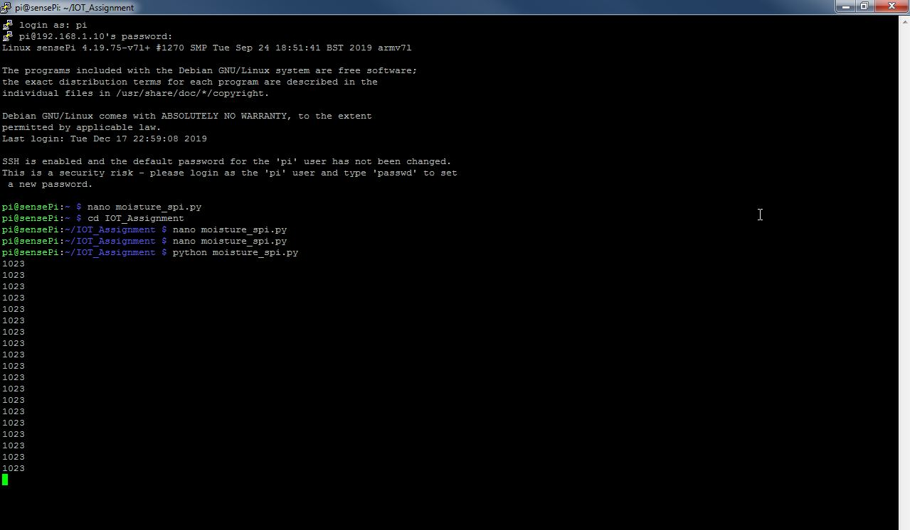
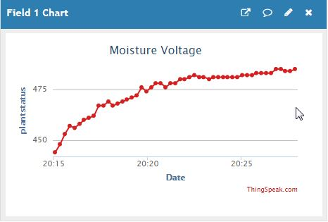
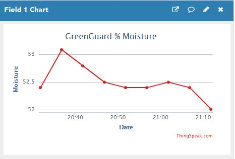

# Greenguard Automated Plant Moisture Detection System 

GreenGuard is a home plant/garden monitoring system for all those green fingered people with a passion for their flora/fauna. The system will monitor your plants at home and provide the moisture content of the soil in which your plant is contained. Using ThingSpeak the user will get a live reading of the moisture content and when the moisture content drops below a certain value then the user will be alerted via email and twitter that the plant/plants need watering. 


-	Raspberry PI 4
-	Raspberry PI Moisture Sensor
-	Raspbian OS
- MCP3008 8 Channel 10-Bit ADC With SPI Interface
-	Python Programming Language
-	ThingSpeak – ThingSpeak for IOT Projects
-	Project Repository

### Data Flow Diagram


### Things Speak Moisture Channel - Click for Live Link
- https://thingspeak.com/channels/938442/)

### Wiring Diagram for the MCP3008 8 Channel 10-Bit ADC With SPI Interface and the Raspberry PI


## Moisture_SPI.py ran on the Raspberry PI

```Python
#!/usr/bin/python

import spidev
import os
import time
import json
import urllib2

#Write API Key for Thingspeak
WRITE_API_KEY='PLKA3BS2S4WOMG30'

#URL for the Thingspeak Web API
baseURL='https://api.thingspeak.com/update?api_key=%s'%WRITE_API_KEY

delay = 0.2

#Python Binding for Serial Peripheral Interface
spi = spidev.SpiDev()

#Open SPI (bus, dev)
spi.open(0,0)

#Define the MAX SPI speed
spi.max_speed_hz=1000000

#Read Channel Function
def readChannel(channel):
  val = spi.xfer2([1,(8+channel)<<4,0])
  data = ((val[1]&3) << 8) + val[2]
  return data

#Try/Catch for read channel and filter out zeros
if __name__ == "__main__":
  try:
    while True:
      val = readChannel(0)
      if (val != 0):
        print(val)
        conn = urllib2.urlopen(baseURL + '&field1=%s' % (val))
        conn.close()
      time.sleep(delay)

  except KeyboardInterrupt:
    print "Cancel."
```
### Sensor Probes not in Water

### Sensor Probes in Water


### ThingSpeak Channel with O/P from ADC



Readings from ADC

1023 Equivalent to 0% moisture

0 equivalent to 100% Moisture

Therefore the Slope and Intercept required to convert the ADC Output to % Moi (Assuming relationship is Linear)

Slope = -0.9775

Intercept = 100

### MathLab Analysis Code for Conversion to % Moisture

```MathLab
% Enter your MATLAB Code below

readChId = 938442; % Channel ID for Greenguard ADC channel
writeChId = 940552; % Channel ID for Dew channel
readKey = 'CNNN91829WXHWOB2'; % Read key for Greenguard ADC channel
writeKey = '10RI2YMW1BK5CY6R';  % Write key for %Moisture Channel
moiadc = thingSpeakRead(readChId,'Fields',1,'NumPoints',1,'Readkey',readKey);
Slope = -0.09775;
Intercept = 100;
moisture = moiadc * Slope + Intercept
thingSpeakWrite(writeChId,[moisture],'Fields',1,'Writekey',writeKey);
```

This code runs every 5 mins via a ThingSpeak Time Control (Minimun Time Allowed in ThingSpeak)




